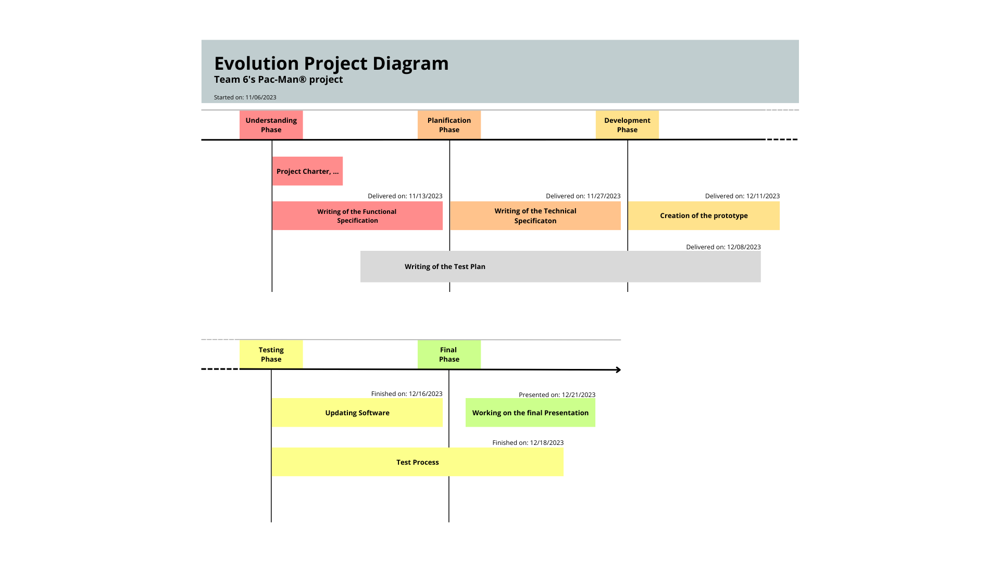
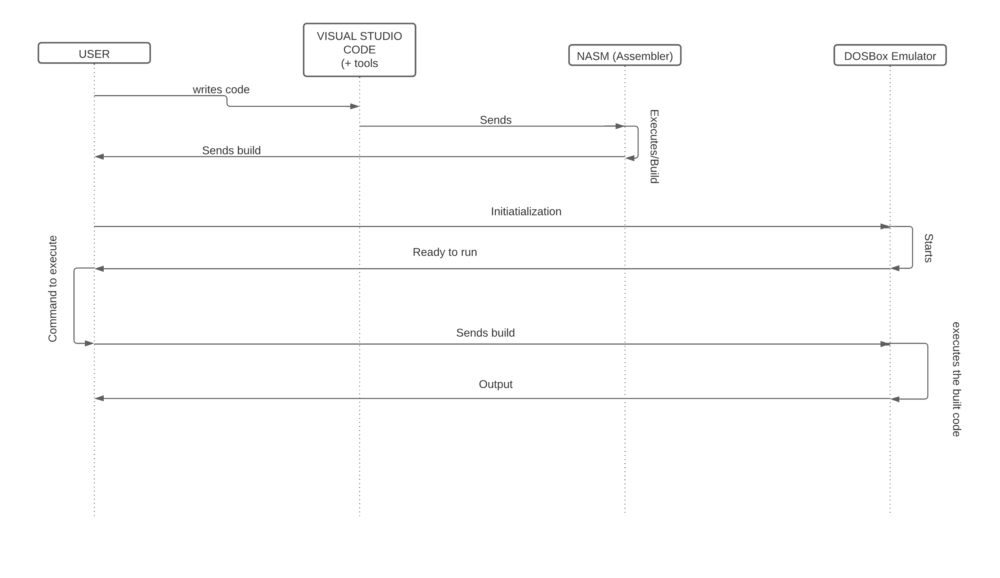
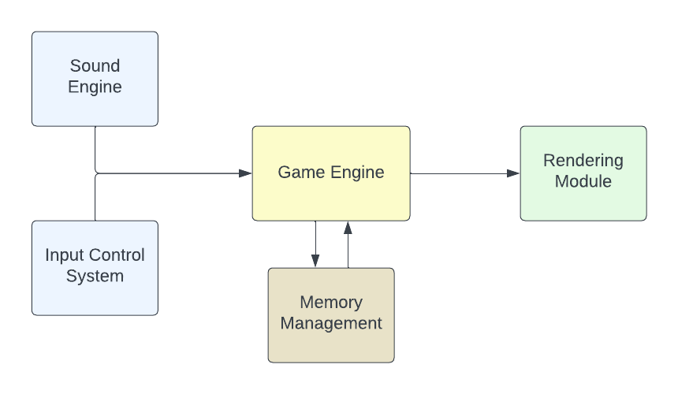

# Technical Specification: Team 6's Pac-Man® Project

| | |
| ----- | ----- |
| Author | Rémy CHARLES|
| Team | Team 6 |
| Reviewer(s) |  |
| Created on | 2023-11-13 |
| Last updated | 2023-11-16 |

## Table of Contents

 Click to expand 

- [Technical Specification: Team 6's Pac-Man® Project](#technical-specification-team-6s-pac-man-project)
  - [Table of Contents](#table-of-contents)
  - [1. Introduction](#1-introduction)
    - [1.1 Project Background](#11-project-background)
    - [1.2 Document Purpose](#12-document-purpose)
      - [Key functions of this document include:](#key-functions-of-this-document-include)
  - [2. Technical Overview](#2-technical-overview)
    - [2.1 System Requirements](#21-system-requirements)
      - [Hardware requirements:](#hardware-requirements)
      - [Software Requirements:](#software-requirements)
      - [Compatibility:](#compatibility)
    - [2.2 Programming Language and Tools](#22-programming-language-and-tools)
      - [NASM (Netwide Assembler):](#nasm-netwide-assembler)
      - [DOSbox Emulator:](#dosbox-emulator)
      - [Development Environment - Visual Studio Code (VSCode):](#development-environment---visual-studio-code-vscode)
      - [Additional Tools:](#additional-tools)
  - [3. System Architecture](#3-system-architecture)
    - [3.1 High-Level Architecture](#31-high-level-architecture)
      - [Core Components:](#core-components)
      - [Data Flow:](#data-flow)
      - [Integration Points:](#integration-points)
    - [3.2 Component Interaction](#32-component-interaction)
      - [Game Engine and Input Control System:](#game-engine-and-input-control-system)
      - [Game Engine and Rendering Module:](#game-engine-and-rendering-module)
      - [Game Engine and Sound Engine:](#game-engine-and-sound-engine)
      - [Game Engine and Memory Management:](#game-engine-and-memory-management)
      - [Integration with DOSBox:](#integration-with-dosbox)
      - [Development and Debugging Tools Integration:](#development-and-debugging-tools-integration)
  - [4. Detailed Component Design](#4-detailed-component-design)
    - [4.1 Game Engine](#41-game-engine)
      - [Core Functions:](#core-functions)
      - [Detailed Component Design:](#detailed-component-design)
      - [Ghost AI and Movement:](#ghost-ai-and-movement)
      - [Collision Detection and Score Management:](#collision-detection-and-score-management)
      - [Integration with Rendering and Sound Engines:](#integration-with-rendering-and-sound-engines)
    - [4.2 New Game Mechanics](#42-new-game-mechanics)
      - [4.2.1 Essential New Game Mechanics](#421-essential-new-game-mechanics)
      - [4.2.2 Potential New Game Mechanics](#422-potential-new-game-mechanics)
      - [Implementation Strategy:](#implementation-strategy)
  - [5. Data Management](#5-data-management)
    - [5.1 Data Storage](#51-data-storage)
      - [Game Data Storage:](#game-data-storage)
      - [High Score Management:](#high-score-management)
      - [Character Data:](#character-data)
      - [Power-Up and Bonus Items:](#power-up-and-bonus-items)
      - [Data Integrity and Error Handling:](#data-integrity-and-error-handling)
    - [5.2 Memory Optimization](#52-memory-optimization)
      - [Optimization Strategies:](#optimization-strategies)
      - [Memory Management Techniques:](#memory-management-techniques)
      - [Monitoring and Profiling:](#monitoring-and-profiling)
      - [Handling Memory Constraints:](#handling-memory-constraints)
  - [6. Acceptance \& Testing Requirements](#6-acceptance--testing-requirements)
    - [6.1 Acceptance](#61-acceptance)
      - [Acceptance Criteria:](#acceptance-criteria)
      - [Acceptance Testing Process:](#acceptance-testing-process)
    - [6.2 Testing Strategy](#62-testing-strategy)
  - [7. Constraints](#7-constraints)
    - [7.1 Technical Constraints](#71-technical-constraints)
      - [Assembly Language Constraints:](#assembly-language-constraints)
      - [x86 Architecture Constraints:](#x86-architecture-constraints)
      - [DOSBox Emulator Constraints:](#dosbox-emulator-constraints)
      - [Hardware Compatibility:](#hardware-compatibility)
      - [Development Environment:](#development-environment)
    - [7.2 Resource Constraints](#72-resource-constraints)
      - [Manpower and Expertise:](#manpower-and-expertise)
      - [Technological Assets:](#technological-assets)
      - [Time Constraints:](#time-constraints)
      - [Budget Limitations:](#budget-limitations)
  - [8. User Interface Design](#8-user-interface-design)
    - [8.1 User Interface](#81-user-interface)
      - [UI Layout and Design:](#ui-layout-and-design)
      - [UI Feedback and Interaction:](#ui-feedback-and-interaction)
      - [Accessibility:](#accessibility)
      - [Customization and Settings:](#customization-and-settings)
      - [UI Prototyping and Testing:](#ui-prototyping-and-testing)
    - [8.2 Audio Design](#82-audio-design)
      - [Sound Effects:](#sound-effects)
      - [Background Music:](#background-music)
      - [Audio Optimization:](#audio-optimization)
      - [Testing and Refinement:](#testing-and-refinement)
  - [9. Security and Privacy Considerations](#9-security-and-privacy-considerations)
    - [9.1 Data Security and Integrity](#91-data-security-and-integrity)
      - [High Score Data:](#high-score-data)
      - [Game Code Integrity:](#game-code-integrity)
    - [9.2 Privacy and Compliance](#92-privacy-and-compliance)
      - [Player Data Handling:](#player-data-handling)
      - [Data Collection Practices:](#data-collection-practices)
  - [10. Maintenance and Support](#10-maintenance-and-support)
    - [10.1 Maintenance Plan](#101-maintenance-plan)
      - [Regular Updates and Bug Fixes:](#regular-updates-and-bug-fixes)
      - [Performance Optimization:](#performance-optimization)
      - [Feature Enhancements:](#feature-enhancements)
    - [10.2 Support Strategy](#102-support-strategy)
      - [Help and Documentation:](#help-and-documentation)
      - [Community Engagement:](#community-engagement)
  - [11. Appendix](#11-appendix)
    - [11.1 Supplementary Materials](#111-supplementary-materials)
    - [11.2 Reference Documents](#112-reference-documents)
    - [11.3 Code Snippets and Examples](#113-code-snippets-and-examples)
    - [11.4 Tools and Software](#114-tools-and-software)
    - [11.5 Meeting Notes and Discussions](#115-meeting-notes-and-discussions)
    - [11.6 Compliance and Legal Documentation](#116-compliance-and-legal-documentation)
  - [12. Glossary](#12-glossary)
    - [12.1 Key Terms and Definitions](#121-key-terms-and-definitions)
    - [12.2 Acronyms](#122-acronyms)
    - [12.3 Game-Specific Terms](#123-game-specific-terms)

## 1. Introduction
### 1.1 Project Background
The Pac-Man® Project is an ambitious endeavor to recreate the iconic arcade game Pac-Man® using Assembly language on an x86 architecture. Inspired by the classic game first released in 1980 by Namco, our project aims not only to replicate the original gameplay experience but also to introduce new features and mechanics that enhance the game while respecting its nostalgic essence.

This project emerged from our team's passion for retro gaming and the technical challenges it presents. The choice of Assembly language, although complex, allows us to delve deep into low-level programming and understand the inner workings of classic arcade games. Our goal is to recreate Pac-Man® in a way that stays true to its original form while pushing our technical abilities and providing a fresh perspective on a beloved classic.

We aim to create a version of Pac-Man® that is both familiar to those who cherished the original and intriguing to new players. This involves maintaining the core mechanics of the original game, such as the maze navigation and ghost-chasing dynamics, while integrating new elements like updated graphics, additional levels, and enhanced user interfaces.

The project's development is supported by the use of the NASM assembler and the DOSBox emulator, ensuring compatibility with modern systems while maintaining the feel of playing on a vintage machine. Through this project, we not only pay homage to a cornerstone of video game history but also sharpen our skills in a challenging and rewarding programming environment.

### 1.2 Document Purpose

This document serves as the Technical Specification for Team 6's Pac-Man® project. Its primary purpose is to provide a comprehensive technical roadmap that outlines the project's software design and architecture. This document is intended to guide the development team through the detailed phases of coding, testing, and deployment, ensuring that all technical aspects of the project align with the predefined objectives and requirements.

#### Key functions of this document include:

- **Detailing Technical Requirements**: It specifies the technical requirements for the project, including programming languages, tools, and hardware compatibility. This ensures that all team members are aware of the technical environment and constraints.

- **Guiding Development Process**: By outlining the architecture, component design, and data management strategies, this document serves as a reference for developers during the implementation phase, ensuring consistency and adherence to best practices.

- **Facilitating Communication**: The document acts as a communication tool among team members, stakeholders, and reviewers, providing clarity and uniform understanding of the project's technical approach.

- **Enabling Scalability and Maintenance**: By presenting a clear view of the system architecture and component interactions, it supports future scalability and maintenance efforts. This foresight is crucial for accommodating potential expansions or modifications.

- **Assisting in Testing and Validation**: The document outlines the testing strategy and deployment plan, guiding the quality assurance process and ensuring that the final product meets the desired performance and functionality standards.

This document is intended for use by the software development team, project managers, and any stakeholders involved in the project. It is a dynamic document and will be updated as the project progresses to reflect any changes in the technical approach or project scope.

## 2. Technical Overview
### 2.1 System Requirements

The system requirements for Team 6's Pac-Man® project are specifically tailored to ensure compatibility and optimal performance for the game's development and execution. These requirements are fundamental to achieving the technical objectives of the project while working within the constraints of our chosen development environment.

#### Hardware requirements:
- **Processor**: Must support x86 architecture, with a preference for a 16-bit processor to closely emulate the original game's environment.
  
- **Memory**: Minimum of 512 KB RAM, with 1 MB or higher recommended for better performance.
  
- **Storage**: A minimum of 10 MB of free disk space for installing the game and storing saved game data.
  
- **Input Devices**: Keyboard interfacing is essential for gameplay control. Optional support for additional input devices like gamepads or joysticks can be considered for enhanced player experience.

#### Software Requirements:
- **Operating System**: DOSBox emulator is a mandatory requirement to provide a DOS environment on modern operating systems. This allows for accurate emulation of the game's intended runtime environment.
  
- **Programming Language**: NASM (Netwide Assembler) is required for Assembly language development, chosen for its direct compatibility with x86 architecture and efficiency in handling low-level operations.
  
- **Development Tools**: A robust text editor (such as VSCode) for coding, integrated with version control systems like Git for source code management. Compatibility with debugging tools that support Assembly language, NASM, and DOSBox integration is crucial for efficient development and troubleshooting.

#### Compatibility:
- The game should be executable on both modern and legacy systems meeting the above hardware specifications. Emphasis on backward compatibility is essential to maintain the authenticity of the gameplay experience.
  
- Ensuring robustness and performance consistency within the DOSBox emulator is critical, as it forms the backbone of our development and testing environment.

These system requirements are designed with a focus on the technical nuances and constraints specific to low-level programming in Assembly language and the emulation of a classic gaming environment. Compliance with these requirements will ensure that the Pac-Man® project is developed with precision, catering to both the nostalgic appeal of the original game and the technical prowess expected in modern software engineering.

### 2.2 Programming Language and Tools
For the development of Team 6's Pac-Man® project, we have selected a set of programming tools and a language that align with our project's technical goals and the necessity for precise low-level programming control.

#### NASM (Netwide Assembler):
- **Role**: Chosen for its direct compatibility with x86 architecture, NASM is our assembler for writing Assembly language code. It is pivotal for developing the intricate low-level functionalities of the game.
  
- **Advantages**: NASM is renowned for its efficiency and flexibility, essential in executing complex programming tasks inherent in game development, such as memory management and hardware interaction.
  
- **Application**: NASM will be utilized for the entire coding process, encompassing the implementation of game mechanics, graphics rendering, and user input handling.

#### DOSbox Emulator:
- **Role**: DOSBox is essential for emulating a DOS environment, allowing us to test and run the game in a setting that mirrors the original hardware conditions.
  
- **Advantages**: By using DOSBox, we can ensure compatibility with modern operating systems while maintaining the authentic feel and constraints of the DOS-based gameplay experience.
  
- **Application**: It serves as the primary platform for testing, debugging, and demonstrating the game, providing a consistent and accurate emulation of the game's performance.

#### Development Environment - Visual Studio Code (VSCode):
- **Primary Tool**: VSCode will be the main development environment for the project, offering a comprehensive and integrated platform for code writing, editing, and debugging.
  
- **Features**: VSCode is selected for its extensive feature set, including advanced syntax highlighting, intelligent code completion, integrated version control with Git, and debugging support. These features enhance development efficiency and collaboration.
  
- **Extensions**: VSCode’s support for extensions allows us to customize the environment to our specific needs, including NASM syntax support and direct integration with DOSBox for seamless testing and debugging.

#### Additional Tools:
- **Build and Automation Scripts**: We will utilize custom scripts to automate repetitive tasks like building and deploying the game, enhancing development efficiency.
  
- **Performance Profiling**: Tools integrated into VSCode will be used to monitor and optimize the game's performance, particularly focusing on CPU and memory usage to ensure smooth gameplay.

*The diagram shows a developer workflow where code written in Visual Studio Code is compiled by NASM and then executed in the DOSBox emulator, resulting in the running Pac-Man® game.*

## 3. System Architecture
### 3.1 High-Level Architecture

The high-level architecture of Team 6's Pac-Man® project is designed with a focus on efficiency and adherence to the constraints of Assembly language and the x86 architecture. Each component is tailored to handle specific functionalities of the game, promoting modularity, scalability, and maintainability.

#### Core Components:
- **Game Engine**: This is the central processing unit of the game, where all game logic, state management, and decision-making processes occur. It's coded to directly manipulate memory addresses and registers for optimal performance.
  - **Technical Implementation**: Utilizes a series of loops and conditional statements to handle real-time game events, with routines optimized for minimal CPU cycle usage.
  
- **Rendering Module**: Handles all aspects of visual output, translating game state data into graphical representations on the screen.
  - **Efficient Drawing Algorithms**: Employs optimized algorithms to render the maze, characters, and UI elements, reducing flickering and maintaining a steady frame rate.

- **Input Control System**: Interprets player inputs from hardware interfaces, translating them into game actions. This system manages interrupt-driven input to capture real-time user interactions.
  - **Hardware Abstraction**: Implements a layer to abstract hardware-specific details, allowing for flexible input handling across different devices.

- **Sound Engine**: Manages audio output, including sound effects and background music. It interacts directly with the system's sound hardware, using Assembly language to control sound channels and volume.
  - **Audio Buffer Management**: Utilizes efficient buffering techniques to handle audio playback without disrupting game performance.

- **Memory Management**: Critically manages memory allocation and access, vital for performance and stability on the x86 architecture.
  - **Dynamic Allocation**: Implements dynamic memory allocation strategies, including memory pooling and efficient garbage collection routines to manage the limited memory resources.

#### Data Flow:
- **Input to Action**: Utilizes interrupt-based input handling to capture player actions and translates them into game logic via the Game Engine.
- **Game State Management**: Employs a state machine within the Game Engine to maintain and update the game's state based on inputs and game rules.
- **Rendering Cycle**: Implements double-buffering in the Rendering Module to minimize screen tearing and ensure smooth visual transitions.
- **Audio Feedback**: Synchronizes audio effects with game events using event-driven programming, enhancing the gaming experience.

#### Integration Points:
- **DOSBox Interface**: Tailors the game engine to operate efficiently within the DOSBox emulator, ensuring compatibility and consistent performance.
- **Development and Debugging Tools**: Integrates with advanced Assembly language development tools in VSCode, including syntax highlighting, code navigation, and profiling tools, to streamline the development process.

This architecture fosters a clear separation of concerns, enabling each module to be developed and tested independently, yet function cohesively within the larger system. The design also allows for future enhancements and modifications with minimal impact on existing functionalities.

*At the center is the Game Engine, orchestrating game logic and interactions.* *It connects to the Rendering Module (for graphics) on the right, the Input Control System (for player inputs) and the Sound Engine (for audio) on the left. Below the Game Engine, the Memory Management component ensures efficient resource utilization.*

### 3.2 Component Interaction

A deeper understanding of component interaction is crucial for effective development and integration in the Pac-Man® game. This section elaborates on how each component within the system architecture communicates and collaborates.

#### Game Engine and Input Control System:
- **Input Processing**: Detailed interrupt handling to capture and process inputs in real-time, feeding them into the game logic.
- **Action Translation**: Converts these inputs into game actions, using optimized routines for quick response and minimal lag.

#### Game Engine and Rendering Module:
- **State Rendering**: Utilizes a pipeline to transfer game state data to the Rendering Module efficiently.
- **Visual Feedback**: Implements specialized rendering routines for different game elements, optimizing resource usage and rendering speed.

#### Game Engine and Sound Engine:
- **Audio Triggers**: Advanced sound queue management to align sound effects with game events, avoiding audio latency issues.
- **Sound Playback**: Direct manipulation of audio channels for precise control over sound playback and volume levels.

#### Game Engine and Memory Management:
- **Resource Allocation**: Employs dynamic memory allocation strategies within the Game Engine for efficient resource management.
- **Performance Optimization**: Focuses on optimizing memory access patterns to enhance overall game performance.

#### Integration with DOSBox:
- **Execution Environment**: Custom configuration of DOSBox to maximize compatibility and performance for the game's specific needs.
- **Compatibility Assurance**: Regular testing and fine-tuning to ensure seamless operation across different DOSBox environments.

#### Development and Debugging Tools Integration:
- **Code Development**: Utilizes advanced features in VSCode for Assembly development, such as custom extensions and integrated debugging.
- **Debugging and Testing**: Emphasizes the use of profiling tools to identify performance bottlenecks and optimize code efficiency.

The detailed exploration of component interactions ensures smooth operation, reflecting the nuanced requirements of real-time gameplay while maintaining the classic feel of Pac-Man®. The modular design also facilitates focused debugging and

## 4. Detailed Component Design
### 4.1 Game Engine
The game engine is a critical component of Team 6's Pac-Man® project, designed to actualize the functionalities described in the functional specification. Its development involves translating these functionalities into efficient and effective Assembly code, optimized for the x86 architecture.

#### Core Functions:
- **Logic Processing:** Responsible for implementing game logic as outlined in the functional specifications. This includes managing ghost behaviors, Pac-Man®'s movements, and collision detection. The development team will focus on translating these specifications into optimized Assembly language code.
  
- **State Management:** Manages and updates the game state, keeping track of positions and statuses of all dynamic elements. This involves designing and managing data structures for low-level operations and quick data access.

- **Input Handling:** Transforms player inputs from keyboard or gamepad into corresponding in-game actions. This will involve setting up interrupt handlers and mapping key presses to game actions.

#### Detailed Component Design:
- **Game Loop:** Central to the engine, the game loop handles input processing, game state updating, and rendering. Optimizing this loop for performance is crucial to maintain smooth gameplay.

- **Data Structures:** The team will employ efficient data structures to manage the maze, ghosts, and Pac-Man®, ensuring quick data retrieval and manipulation.

#### Ghost AI and Movement:
- **Pathfinding:** Developing pathfinding algorithms to guide ghost movements, balancing complexity with the computational limitations of the target hardware.

- **Behavior States:** Implementing state machines for each ghost to manage their behaviors (chase, scatter, frightened, returning home), following the functional specification.

#### Collision Detection and Score Management:
- **Collision Detection:** Developing algorithms for detecting collisions between Pac-Man®, ghosts, and maze walls, using bounding box calculations or similar methods.

- **Scoring System:** Implementing a scoring system as defined in the functional specification, ensuring accurate and real-time score updates.

#### Integration with Rendering and Sound Engines:
- **Rendering Calls:** Establishing a subsystem within the engine for rendering, which includes communicating character positions and game state to the Rendering Module.

- **Sound Triggers:** Integrating sound effects and music, triggered based on the game state and events.

This blueprint guides the development team in building a game engine that not only aligns with the original Pac-Man® in efficiency but is also adaptable for future enhancements.

`[GameLogicDiagram]`

### 4.2 New Game Mechanics
In line with the functional specifications, the development team will integrate new game mechanics into the Pac-Man® project. These enhancements are designed to add depth and modern touches to the classic game while maintaining its original charm.

#### 4.2.1 Essential New Game Mechanics
- **UI Modifications:** Redesigning the user interface to add original elements while keeping the classic feel. This includes new menu designs, score displays, and potentially new color schemes.

  - **Implementation:** The team will develop custom UI elements in Assembly language, ensuring they are both visually appealing and functionally integrated with the game’s core mechanics.

- **New Maze Design:** Introducing an additional maze layout as an alternate game mode, offering players a fresh challenge.

  - **Development:** Creating a new maze layout involves designing the maze structure and implementing it in the game’s code, ensuring it aligns with the original Pac-Man® gameplay mechanics.

#### 4.2.2 Potential New Game Mechanics
- **New Powers for Power Pellets:** Exploring the addition of new abilities granted by power pellets, like temporary invincibility or instant ghost defeat.

  - **Prototyping:** The team will prototype various new power-up concepts, testing them for balance and integration with the existing game dynamics.

- **Character Customization:** Allowing players to customize Pac-Man®'s appearance, adding a personal touch to the game experience.

  - **Design and Integration:** This involves designing a range of customizable options and integrating them into the game settings, with considerations for memory usage and rendering.

#### Implementation Strategy:
- **Modular Development:** Each new mechanic will be developed as a modular component, allowing for independent testing and integration without disrupting the core game functionality.

- **Performance Optimization:** Given the constraints of Assembly programming, optimizing these new mechanics for performance and memory usage is critical.

- **Feedback and Iteration:** The team will regularly test these new features, gather feedback, and iterate to refine and improve them, ensuring they enhance the overall gameplay experience.

These new mechanics are aimed at modernizing the Pac-Man® experience while respecting the game's original essence. The development team will focus on implementing these features in a way that is both technically feasible and faithful to the spirit of the classic game.

`[UIScreenMockups]`

## 5. Data Management
### 5.1 Data Storage
Efficient data management is critical for the performance and stability of the Pac-Man® project. The team will implement data storage strategies optimized for Assembly language on x86 architecture, focusing on compactness and speed.

#### Game Data Storage:
- **Maze Data:**
  - **Structure:** Store maze layout in a compact binary format, using a two-dimensional array. Each cell represents a section of the maze, encoded for walls, paths, and item locations.
  
  - **Example:** `maze_data DB 0x0F, 0x1B, 0x0F ... ; maze represented in hex`
  
  - **Access:** Implement efficient routines for reading and writing to this array, ensuring quick updates during gameplay.

- **Game State:**
  - **Representation:** Utilize a set of registers or a contiguous block of memory to store the current game state, including player scores, lives, and level.

  - **Example:** `game_state DB 3 ; 3 lives, score DW 0 ; initial score 0`
  
  - **Update Mechanism:** Develop routines to update this state after key game events like scoring or losing a life.

#### High Score Management:
- **Storage Mechanism:** Use a structured format for high scores, with a fixed-size record for each entry (e.g., player initials and score).

  - **Implementation:** `high_scores DB 'AAA', 5000, 'BBB', 4500 ... ; high scores table`
  
  - **Retrieval and Update:** Implement procedures for sorting and updating this table whenever a new high score is achieved.

#### Character Data:
- **Pac-Man® and Ghosts:**
  - **Data Structure:** Store each character’s position, direction, and state. Optimize the representation to occupy minimal memory space.
  
  - **Example:** `pacman DB x_position, y_position, direction, state`
  
  - **Movement and Update:** Efficiently update these data points in response to game events or player inputs.

#### Power-Up and Bonus Items:
- **Item Tracking:** Keep track of power-ups and bonus items with flags or counters, indicating their states and locations.

  - **Example:** `power_pellets DW 0x0011 ; binary flags for power pellet states`
  
  - **Effect Management:** Code routines to toggle these flags when items are consumed or activated.

#### Data Integrity and Error Handling:
- **Checks and Balances:** Implement validation checks, especially during game state transitions, to ensure data consistency.

- **Error Routines:** Develop error-handling routines to address discrepancies, such as out-of-bounds errors or invalid state transitions.

The data management approach is tailored for Assembly language programming, ensuring that data structures are lean and access routines are efficient. This strategy will support the game's need for fast and frequent data access, a critical aspect of real-time gameplay on the x86 platform.

### 5.2 Memory Optimization
Optimizing memory usage is a critical aspect of the Pac-Man® project, particularly given the constraints of Assembly language and x86 architecture. The development team will employ strategies to ensure that the game uses memory resources efficiently, reducing the risk of overruns and enhancing performance.

#### Optimization Strategies:
- **Memory Allocation:** Careful allocation of memory resources, avoiding unnecessary memory consumption. For instance, using registers for frequently accessed data and reserving memory blocks only as needed.

  - **Example:** `MOV AX, gameState ; storing game state in a register for quick access`
  
- **Data Structure Efficiency:** Using data structures that minimize memory overhead. Optimize the size of variables and arrays to match the exact requirements of the game data.
  
  - **Example:** `DB 0x00 ; using a byte for simple flags instead of larger data types`
  
- **Memory Reuse and Recycling:** Where possible, reuse memory blocks for different purposes throughout the game lifecycle, rather than allocating new memory each time.
  
  - **Implementation:** Implement routines to clear and repurpose memory blocks once they are no longer needed.

#### Memory Management Techniques:
- **Buffer Management:** Efficient management of buffers, especially for rendering and input handling, to ensure they do not consume more memory than necessary.
  
- **Heap vs Stack Usage:** Strategic use of the stack for temporary data and the heap for more permanent data, balancing between quick access and dynamic memory needs.
  
- **Garbage Collection:** Implementing manual garbage collection routines to free up memory space that is no longer in use, particularly in longer gameplay sessions.

#### Monitoring and Profiling:
- **Memory Profiling:** Regularly profiling the game to monitor memory usage patterns and identify areas where optimizations can be made.
  
- **Debugging Tools:** Utilizing debugging tools that provide insights into memory allocation, usage, and potential leaks.

#### Handling Memory Constraints:
- **Fallback Mechanisms:** Establishing fallback mechanisms in case of memory allocation failures, such as simplifying game elements or reducing the complexity of certain operations.
  
- **Optimization Loops:** Continuously refining memory usage through iterative development cycles, constantly seeking improvements and optimizations.

Through these memory optimization strategies, the team will ensure that the Pac-Man® project runs efficiently on the targeted hardware, maintaining a balance between performance, complexity, and the immersive experience of the game.

## 6. Acceptance & Testing Requirements

### 6.1 Acceptance
Acceptance criteria for the Pac-Man® project are set to ensure that the final product meets the quality standards and functional requirements outlined in the specifications. These criteria serve as the benchmark for evaluating the game's readiness for release.

#### Acceptance Criteria:
- **Functional Completeness:** The game must include all core and new game mechanics as specified, including character movements, ghost behaviors, scoring system, and any additional features like new mazes or power-ups.
  
  - **Verification:** Conduct thorough testing to ensure each feature works as intended and integrates seamlessly with the rest of the game.
  
- **Performance Standards:** The game should run smoothly without any significant lag or performance issues on the targeted x86 hardware.
  
  - **Measurement:** Use performance profiling tools to monitor frame rates, response times, and resource utilization, ensuring they meet predefined benchmarks.
  
- **User Interface and Experience:** The game’s UI should be user-friendly, visually appealing, and consistent with the game’s aesthetic. Gameplay should be engaging, challenging, and true to the original Pac-Man® experience.
  
  - **Evaluation:** Gather feedback from test users on their experience, focusing on ease of navigation, visual appeal, and overall enjoyment.
  
- **Stability and Reliability:** The game must be free of critical bugs or crashes. It should handle edge cases and unexpected user inputs gracefully.
  
  - **Testing:** Implement comprehensive testing, including stress and edge-case scenarios, to ensure stability across various gameplay conditions.
  
- **Compliance with Specifications:** The final product must adhere strictly to the technical and functional specifications outlined in this document.
  
  - **Review:** Conduct a final review against the technical specification document to verify compliance with all requirements.

#### Acceptance Testing Process:
- **Test Plan Execution:** Follow a structured test plan that covers all aspects of the game, including functional, performance, and user experience tests.
  
- **Feedback Loop:** Establish a feedback loop with the testing team, allowing for the prompt reporting, tracking, and resolution of any issues or deviations from the specifications.
  
- **Final Validation:** Upon satisfactory completion of all tests and resolution of issues, conduct a final validation against the acceptance criteria.

The acceptance phase is crucial in ensuring that the Pac-Man® project delivers a high-quality, enjoyable, and stable gaming experience that aligns with both the vision of the original game and the enhancements proposed in this project.

### 6.2 Testing Strategy

See the [Testing Strategy]() document for details.

## 7. Constraints
### 7.1 Technical Constraints
The development of the Pac-Man® project is subject to several technical constraints, largely due to the choice of Assembly language and the x86 architecture. These constraints must be carefully managed to ensure the successful completion of the project.

#### Assembly Language Constraints:
- **Low-Level Programming:** Assembly language, being a low-level language, requires a detailed understanding of the hardware architecture and direct memory management.

  - **Impact:** This demands a high level of technical expertise and meticulous attention to detail in programming.
  
- **Code Complexity:** Writing in Assembly can result in verbose and complex code for operations that are relatively simple in higher-level languages.

  - **Mitigation:** Emphasize code clarity and organization, and where possible, abstract and modularize repetitive code.

#### x86 Architecture Constraints:
- **Memory Limitations:** The x86 architecture, especially in its earlier variants, has limitations in terms of memory capacity and management.

  - **Strategy:** Optimize memory usage within the game, ensuring efficient data structures and memory allocation techniques.
  
- **Processing Power:** Constraints on processing power necessitate highly efficient coding practices to ensure smooth gameplay.

  - **Approach:** Focus on performance optimization, such as minimizing CPU cycles and optimizing algorithms for speed.

#### DOSBox Emulator Constraints:
- **Compatibility:** The game must run smoothly within the DOSBox emulator, which replicates an older computing environment.

  - **Testing:** Regular testing within DOSBox to ensure compatibility and performance.
  
- **Emulation Limitations:** Certain advanced features available in modern systems may not be fully supported or may behave differently in DOSBox.

  - **Adaptation:** Adapt game design and features to align with the capabilities and limitations of DOSBox.

#### Hardware Compatibility:
- **Varied Systems:** Ensuring the game runs effectively on a range of systems with differing specifications.

  - **Testing and Optimization:** Conduct extensive testing on different hardware setups and optimize for broader compatibility.

#### Development Environment:
- **Tool Limitations:** The availability and functionality of development and debugging tools for Assembly language are limited compared to higher-level languages.

  - **Resourcefulness:** Leverage the best available tools and develop custom tools or scripts as needed to aid in development and debugging.

These technical constraints require careful planning, skilled programming, and ongoing testing to address. The development team will need to work within these parameters, ensuring that the final product is both technically sound and true to the envisioned gameplay experience.

### 7.2 Resource Constraints
Resource constraints are a significant consideration in the Pac-Man® project, impacting various aspects of development, from manpower to technological assets. These constraints must be managed effectively to ensure the project's successful and timely completion.

#### Manpower and Expertise:
- **Limited Personnel:** The team size and the specific expertise of each member, particularly in Assembly language and x86 architecture, can be a limiting factor.

  - **Strategy:** Maximize efficiency through careful task allocation, ensuring team members work on areas aligned with their strengths. Encourage knowledge sharing and collaboration to optimize output.
  
- **Training and Learning Curve:** The specialized nature of Assembly language programming may require additional training or upskilling for team members.

  - **Approach:** Allocate time for learning and training sessions, and consider mentorship or pairing for less experienced team members with experts.

#### Technological Assets:
- **Development Tools:** The availability and sophistication of tools for Assembly language development are limited compared to more modern programming environments.

  - **Mitigation:** Invest time in identifying and setting up the most effective toolset. Consider developing custom tools or scripts to streamline development processes.
  
- **Testing and Debugging Tools:** Tools for testing and debugging Assembly language code are less advanced and user-friendly.

  - **Solution:** Develop robust testing strategies using available tools and create custom testing scripts to automate and simplify the testing process.

#### Time Constraints:
- **Project Deadlines:** Adhering to the project schedule is crucial, but resource limitations can impact the ability to meet deadlines.

  - **Time Management:** Implement efficient project management practices, prioritize tasks, and set realistic milestones considering the available resources.

- **Feature Implementation:** Resource constraints may limit the scope of features that can be implemented within the project timeline.

  - **Prioritization:** Focus on core game functionalities and prioritize additional features based on their impact and feasibility within the time and resource constraints.

#### Budget Limitations:
- **Financial Constraints:** Budget restrictions can limit access to certain tools, resources, or additional manpower.

  - **Cost-Effective Planning:** Optimize resource allocation and explore cost-effective solutions, such as open-source tools or community resources.

Managing these resource constraints effectively is key to navigating the challenges of the Pac-Man® project. Strategic planning, efficient use of available resources, and adaptability in the face of limitations will be crucial for the project’s success.

## 8. User Interface Design
### 8.1 User Interface
Designing an intuitive and appealing user interface (UI) is a critical aspect of the Pac-Man® project. The UI design must balance the classic feel of the original game with modern usability standards, ensuring a seamless and engaging experience for the players.

#### UI Layout and Design:
- **Main Menu:** The main menu is the first point of interaction for players. It should be straightforward and easy to navigate.

  - **Elements:** Include options such as 'Start Game', 'High Scores', 'Settings', and 'Exit'.

  - **Design:** Use a layout that is visually aligned with the game's retro aesthetic. `[MainMenuLayoutImage]`
  
- **Gameplay Interface:** The in-game UI should provide necessary information without cluttering the screen.

  - **Components:** Display elements like current score, lives left, level number, and any power-up timers.
  
  - **Visibility:** Ensure all UI components are easily readable and do not obstruct gameplay. `[GameplayInterfaceImage]`

#### UI Feedback and Interaction:
- **Responsiveness:** UI elements should respond to user inputs promptly, providing immediate and intuitive feedback.

- **Animations and Effects:** Subtle animations or effects for button presses or transitions can enhance the user experience.

  - **Example:** A slight animation on menu selection or a visual effect when achieving a high score.

#### Accessibility:
- **Color Schemes:** Choose colors that are comfortable to view and cater to a broad audience, including those with color vision deficiencies.
  
- **Font and Readability:** Use legible fonts and appropriate sizes for text to ensure readability across various devices and resolutions.

#### Customization and Settings:
- **Player Preferences:** Include options that allow players to customize their experience, such as audio volume controls and potential color scheme choices.

- **Settings Menu:** Design a settings menu that is easy to navigate and adjust. `[SettingsMenuImage]`

#### UI Prototyping and Testing:
- **Mockups and Prototypes:** Create initial mockups and interactive prototypes of the UI for early testing and feedback.

  - **Tools:** Utilize tools like Adobe XD, Sketch, or similar for prototyping.
  
- **User Testing:** Conduct user testing sessions to gather feedback on the UI design, focusing on usability and player experience.

The user interface design for the Pac-Man® project is a bridge between the game's classic roots and modern gaming expectations. It should be both a nod to nostalgia and a testament to contemporary design principles, ensuring a smooth and enjoyable user experience. `[CompleteUIDesignImage]`

### 8.2 Audio Design
The audio design in the Pac-Man® project is pivotal for creating an immersive and nostalgic gaming experience. It involves carefully crafting sound effects, background music, and audio feedback that resonate with the game’s classic legacy while enhancing the modern gameplay experience.

#### Sound Effects:
- **Gameplay Sounds:** Design distinct sound effects for key gameplay events like Pac-Man® eating pellets, power-ups, ghost encounters, and losing a life.
  
  - **Creation and Selection:** Utilize digital audio workstations (DAWs) or sound editing tools to create or select appropriate sounds. Ensure they are clear and distinct even in a rapid gameplay context. 
  
- **Feedback Sounds:** Implement auditory feedback for player actions, such as menu selections or successful completion of levels.
  
  - **Integration:** Integrate these sounds into the game engine, ensuring they are triggered accurately in response to player actions.

#### Background Music:
- **Thematic Music:** Compose or select background music that aligns with the game’s retro theme while adding a modern touch.

  - **Looping and Variation:** Ensure the music loops seamlessly and varies across different levels or game states. 
  
- **Adaptive Music:** Explore the possibility of adaptive music that changes based on gameplay, such as increasing tempo during high-stress moments.

#### Audio Optimization:
- **File Formats and Size:** Optimize audio files for size and quality to balance the audio fidelity with the limitations of the x86 architecture.

  - **Example:** Use compressed audio formats that retain quality while minimizing file size.
  
- **Volume Control:** Implement user-controlled volume settings for sound effects and music, allowing players to customize their audio experience.

#### Testing and Refinement:
- **Audio Testing:** Conduct thorough testing of all sound elements to ensure clarity, appropriateness, and lack of audio glitches or overlaps.

- **User Feedback:** Gather feedback from test players on the audio experience, focusing on the enjoyment and enhancement of the game’s atmosphere.

The audio design in the Pac-Man® project should augment the visual and gameplay elements, contributing to an engaging and memorable player experience. The sound effects and music are not just auditory embellishments but core components of the game’s identity and appeal. 

## 9. Security and Privacy Considerations

### 9.1 Data Security and Integrity
Ensuring data security and the integrity of the game code are paramount in the Pac-Man® project, especially to maintain the trust of players and the authenticity of the gameplay experience.

#### High Score Data:
- **Secure Storage:** Implement methods for securely storing high score data to prevent unauthorized access and tampering.
  - **Approach:** Utilize encryption or secure hashing where necessary, especially if player identifiers are involved.

#### Game Code Integrity:
- **Tamper Resistance:** Ensure the game code and assets are protected against unauthorized modifications, which could impact gameplay or scores.
  - **Methods:** Use checksums, digital signatures, or similar techniques to verify the integrity of the game code and assets.

### 9.2 Privacy and Compliance
Respecting player privacy and adhering to legal compliance are crucial, especially if any player data is collected or if the game includes online features.

#### Player Data Handling:
- **Privacy Policy:** If player information (like names for high scores) is collected, handle it responsibly and transparently.
  - **Documentation:** Create a clear privacy policy that outlines data usage and storage practices, ensuring compliance with relevant laws.

#### Data Collection Practices:
- **Minimization and Transparency:** Collect only necessary player data, and be transparent about any data collection.
  - **Player Consent:** Obtain consent for data collection where applicable and provide options for players to opt out.

Adhering to these security and privacy considerations is vital for upholding the integrity of the Pac-Man® project and maintaining player trust. These measures are essential in the context of modern gaming, where data security and privacy are of paramount importance.

## 10. Maintenance and Support
Maintaining and supporting the Pac-Man® project post-launch is crucial to ensure its longevity and continued player satisfaction. A comprehensive maintenance plan is outlined to address potential issues and incorporate improvements over time.

### 10.1 Maintenance Plan
A structured approach to maintaining the game, focusing on regular updates, bug fixes, and adaptation to evolving player expectations.

#### Regular Updates and Bug Fixes:
- **Patch Releases:** Schedule regular updates to address known bugs, improve performance, and refine gameplay mechanics.
  - **Frequency:** Plan for quarterly updates, or more frequently if critical issues arise.
- **Community Feedback:** Monitor player feedback channels (like forums, social media) for reports of bugs or suggestions for improvements.
  - **Response Strategy:** Establish a system for tracking, prioritizing, and addressing feedback in subsequent updates.

#### Performance Optimization:
- **Ongoing Monitoring:** Continuously monitor the game’s performance across various systems to identify areas for optimization.
  - **Tools:** Utilize performance profiling tools to pinpoint and address performance bottlenecks.

#### Feature Enhancements:
- **Future Additions:** Consider introducing new features or content, such as additional mazes or game modes, based on player demand and feasibility.
  - **Planning:** Evaluate and roadmap these enhancements for future updates, ensuring they align with the game’s core concept.

### 10.2 Support Strategy
Providing effective support to address user concerns and maintain a positive player experience.

#### Help and Documentation:
- **User Guides:** Maintain comprehensive user guides and FAQs to assist players in understanding game mechanics and resolving common issues.
- **Online Support:** Offer online support channels, such as a dedicated support email or forum, for players to report issues or seek assistance.

#### Community Engagement:
- **Player Community:** Foster a community of players through social media, forums, or dedicated platforms. Engage with this community for feedback, support, and promotion of game updates.
- **Community Events:** Consider hosting online events or contests to keep the player community engaged and active.

The maintenance and support plan for the Pac-Man® project is designed to ensure the game remains relevant, enjoyable, and technically sound post-launch. Regular updates, performance optimizations, and active community engagement are key components of this plan, contributing to the game’s long-term success and player satisfaction.

## 11. Appendix
The Appendix section of this document serves as a repository for additional resources, documentation, and materials that provide supplementary information and support for the Pac-Man® project.

### 11.1 Supplementary Materials
- **Gantt Chart of Project Timeline:** Detailed timeline showcasing the project's phases, milestones, and deadlines. `[GanttChartImage]`
- **Technical Diagrams:**
  - System Architecture Diagram: Visual representation of the game's architecture. `[SystemArchitectureDiagram]`
  - Data Flow Diagrams: Illustrate how data moves through the game's systems. `[DataFlowDiagrams]`
  - Class or Module Diagrams (if applicable): Show the structure of the game's programming modules. `[ClassOrModuleDiagrams]`

### 11.2 Reference Documents
- **Original Pac-Man® Game Design Document:** A reference to the original game’s design for historical and comparison purposes.
- **Assembly Language Programming Guides:** Manuals and guides for Assembly language programming specific to x86 architecture.
- **DOSBox Emulator Documentation:** Comprehensive guide on using DOSBox for development and testing.

### 11.3 Code Snippets and Examples
- **Sample Code:** Examples of key code segments used in the game, such as ghost AI algorithms, collision detection routines, and UI rendering scripts.
- **Debugging and Testing Scripts:** Scripts and tools developed for debugging and testing the game during development.

### 11.4 Tools and Software
- **List of Development Tools:** Detailed list of all software and tools used in the development of the game, including text editors, version control systems, and testing tools.
- **Custom Tool Documentation:** If any custom tools or scripts were developed for the project, include their documentation here.

### 11.5 Meeting Notes and Discussions
- **Team Meeting Summaries:** Records of significant team meetings, outlining decisions, discussions, and action items.
- **Expert Consultations:** Notes from consultations with experts in Assembly language or game design, if applicable.

### 11.6 Compliance and Legal Documentation
- **Compliance Checklists:** Documentation of compliance with relevant legal and industry standards.
- **License and Copyright Information:** Information on licensing, especially concerning the use of the Pac-Man® name and assets.

## 12. Glossary
This glossary provides definitions for technical terms, concepts, and acronyms used in the Pac-Man® project documentation. It is intended to clarify meanings and ensure a common understanding among all project stakeholders.

### 12.1 Key Terms and Definitions
- **Assembly Language:** A low-level programming language that uses a strong correspondence between the language instructions and the architecture's machine code instructions.
- **x86 Architecture:** A family of backward-compatible instruction set architectures based on the Intel 8086 CPU and its Intel 8088 variant.
- **DOSBox:** An emulator program that creates a DOS-like environment for running older software and games on modern operating systems.
- **Gantt Chart:** A type of bar chart that illustrates a project schedule, showing the start and finish dates of elements.
- **Checksum:** A method used to verify the integrity of data by generating a value (checksum) based on the data content.
- **Digital Signature:** A technique used to validate the authenticity and integrity of a message, software, or digital document.
- **Debugging:** The process of identifying and resolving errors, flaws, or faults in a computer program.

### 12.2 Acronyms
- **UI (User Interface):** The space where interactions between humans and machines occur.
- **DAW (Digital Audio Workstation):** An electronic device or software application for recording, editing, and producing audio files.
- **CPU (Central Processing Unit):** The primary component of a computer that performs most of the processing inside the computer.

### 12.3 Game-Specific Terms
- **Pac-Man®:** The player character in the game, known for eating dots in a maze while avoiding ghosts.
- **Ghosts:** Characters in the game that chase Pac-Man® and have distinct behaviors (Blinky, Pinky, Inky, Clyde).
- **Power Pellet:** An item in the game that allows Pac-Man® to eat ghosts for a short period.

This glossary serves as a reference tool for understanding specific terms and jargon used in the context of the Pac-Man® project documentation.

