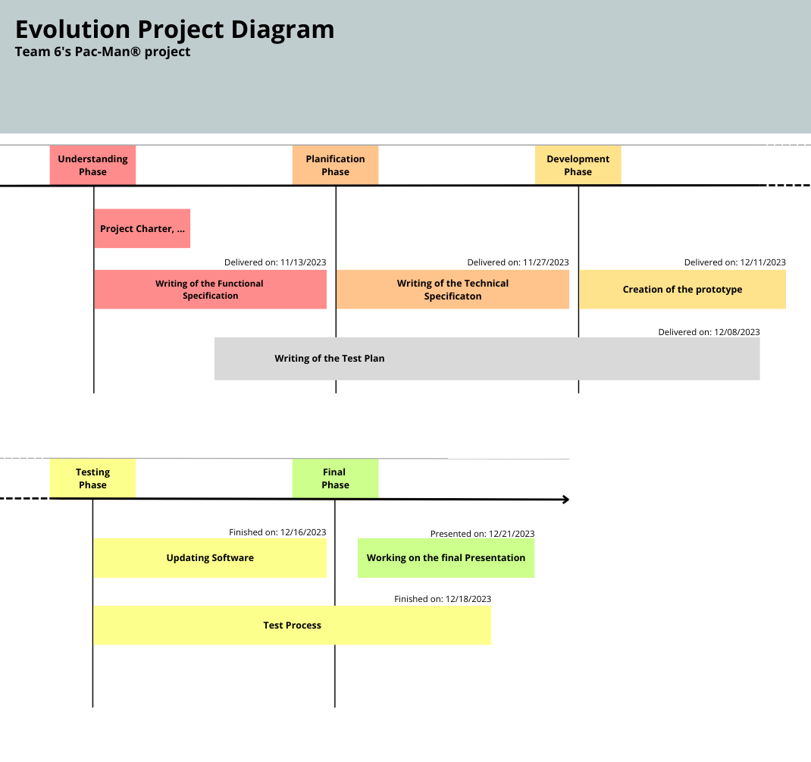

# Weekly Report Team 6 : Week 46 

 

| Author :        |
| :-------------- |
| **Raphaël Descamps**  |

###   Functional Specification progress

The functional specification have been completed and was then uploaded to our GitHub repository. 

*Thibaud Marlier*

### Technical Specification progress 

The technical specification work is in progress, it will be done on time so the devs will start developing our pac-man version. 

*Rémy Charles*

### Assembly knowledge

the engineering softwares are well advanced in their reading of the assembly book. Furthermore, they're working on their own to have a better understanding of it. They're practicing on 
exercises given by the teacher. And they're starting to try their hand at coding our game

Moreover, the rest of the team is working on learning assembly so that they can help the software engineers when needed.

*All Team* 

### Project management 

For the organization and distribution of tasks within the team, the project manager did set up an online timetable where each team member can see what they've done and how they had to organize their tasks with the given time. This allowed us to be much more organized and saved time in our work

The weekly report is also being written. As well as updating our Gantt to keep track of our team's work.

*Raphaël Descamps* 

### Development of our game 

Now that our junior Softwar engineers have some knowledge of assembly, they can now choose a map for our game and begin coding it to get a feel for it.

*Junior Software Engineer*

### Advencement about the Test Plan

Our QA started making a test plan by taking examples from already existing professional test plans. 

*Manech Laguens* 

### Advencement of our Technical 

At the end of the week, the techlead and program manager decided to work together on editing the technical section, to be more efficient. 

*Rémy Charles & Thibaud Marlier* 

### Our ideas 

After brainstorming all the ideas in terms of map design, powers to be added and customizations. Our Program Manager decided to create a form and send it out to all the school's students. We then asked the other students to give their opinion on our ideas. Then, if they wished, they could give us advice or ideas on certain designs to improve the ideas we wanted to implement in our game. 

*Thibaud Marlier & All Team* 

### Next week's schedule 

* The junior software engineers must continue to work on their assembly skills, like all the other team members. But they need to make progress on the game's code. More specifically, they need to finish coding our map and start creating the monsters if the map is done.

* The program manager and tech lead will continue to write the functional in order to deliver it on time, on 11/27/2023. And to enable the junior software engineer to continue developing the game.

* The QA will have to check the documents supplied to him, such as our weekly report and the technical.

* The project manager will continue to distribute tasks to each team member, and will then continue to draft the weekly report and its diagrams and documents to keep the team's various information up to date.

  