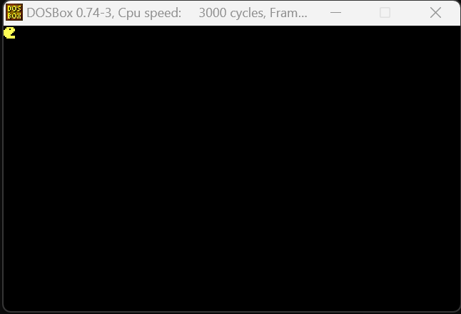

# Weekly Report Team 6 : Week 47 

 

| Author :        |
| :-------------- |
| **Raphaël Descamps**  

###   Learning Assembly and Code 

For this week, the developers began to work on the maze. They tried to get the Pac-Man character to 
react to the borders, so it wont cross the walls. 

Here's the result of our first maze display prototype : 

  

*Software Engineer & Rémy Charles* 

### QA Documents 

Our QA continued to write the Test Plan that we will use to test our working version of Pac-Man.

*Manech Laguens*

### Technical Specification progress 

The technical is well advanced, so we're waiting for the developers to be much more advanced on their code for the game. Despite this, all ideas are written, selected and sorted. 

*Rémy Charles & Thibaud Marlier*

### Management and Document 

A "Mangement" document, listing all documents related to team management, has been written and published on our Github, making it easier for StakHodlder to follow our progress on this project. 

In addition, a document called "Difficulties Documents Managements" has been written and will be kept throughout the project to record the difficulties and solutions we faced during the project. This document is available as a clickable link in the "Management" folders. 

Here's a link to the "management" document : [Management](../Management/management.md)

Then the trello was updated, the tasks for each role and the rest of the week were shared.

*Raphaël Descamps* 

### ReadMe Writing 

The ReadMe was late in being written, but at last it allows us to present our team and our project in a single project. 

*Raphaël Descamps*

### Learning Assembly and Code 

During the rest of this week, we made good progress on our maze display. Here are the versions of our maze we've been through.  

  

As you can see from the photo above, we have a color problem: we cant understand if it's hexadecimal or not. 

Below is another image of our maze where we managed to unify the colors, but it’s still not the final 
one. 

  

We also managed to display our Pac Man character. 

  

And here's below our final version of our maze with the correct display and the overflow problem solved. 

  

*Rémy Charles & All team* 

### Next week's schedule 

* The junior software developers and team members are going to have to work even harder on developing our game. More specifically, we need to work on the direction of our Pac-Man and change the face of our pac man with his mouth open and closed. 

    In addition, we need to start developing the menu for our game. To have an interface before starting the game. 

    We also need to make progress on our character's reaction to a wall. 

* Our QA will have to continue writing his test plan. 

* The Program Manager will help the techlead to finish writing and formatting the technical due to 11/27/2023.

