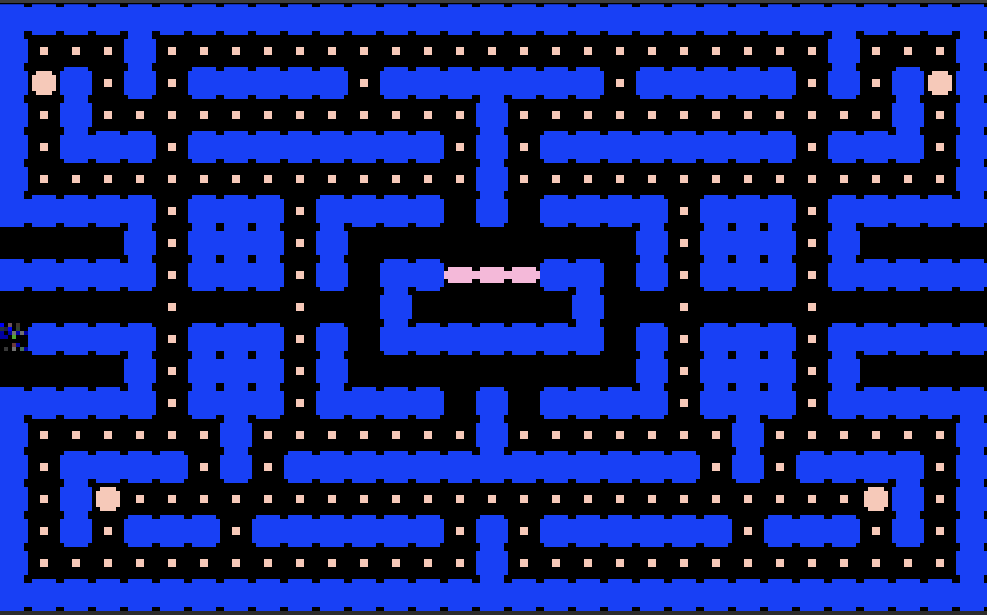

# Weekly Report Team 6 : Week 49

 

| Author :        |
| :-------------- |
| **Raphaël Descamps**  

###   Learning Assembly and Code 

We realized that our maze sprite was actually a bad idea. 

We had to determine the game's borders to ensure that our Pac-Man doesn't cross the walls, but with a maze sprite, it would have been too complicated to do. 

It means that we would have to code pixel by pixel to determine which pixels are crossed and which are not. 

So we decided to code our maze in ascii code. All we had to do was to determine which color not to cross.

It was much simpler and faster. Instead of doing it pixel by pixel.

*Junior Software Engineers, Thibaud Marlier & Rémy Charles*

### QA Test Plan

Our QA finished writing the test plan and the test cases.

After the QA finished, corrected and checked the test plan, he turned his attention on the prototype, which must be done before Monday 5pm.

*Manech Laguens* 

### Management

To solve our delay issue and to ensure the delivery of our game on the right date, the Program Manager and the Techlead worked in cohesion with our Junior Software Engineers to make progress as quickly and efficiently as possible on our game.

In the meantime, the QA continued drafting his test plan, as described above. 

The Project Manager the wrote all the documents he was supposed to hand in. Once he was done, he then helped the Software Engineers with the game development.

*Raphaël Descamps*

### Change on the Maze 

Initially, we coded our maze as a sprite. But thanks to the assembly course, we realized that if we left our maze in sprite, we'd have trouble making the characters collide. 

We've decided to code the maze in ascii code. And we succeeded, but it took a long time. So here's a picture of our maze in ascii code, once its done. 

  

The image above represents our maze for the prototype due on 12/11/2023. But this is not our final maze. 

*Rémy Charles*

### QA Test Plan

Our QA, has finished writing and editing his test plan. His test plan will enable us to test our prototype and our final version, to avoid as many errors and problems as possible on our game.

*Manech Laguens* 

### Next week's schedule 

* Our junior software engineers have to bring our prototype forward for delivery on Monday 12/112023. 

* We have to start drafting our oral and our slide show in two weeks time. 

* More specifically, we need to make progress on the ghosts' code, i.e. their movements and powers. 

The project manager will then write all the documents he's supposed to hand in, and once finished, he'll also help the software engineers with the development of our game. 

*Raphaël Descamps* 
